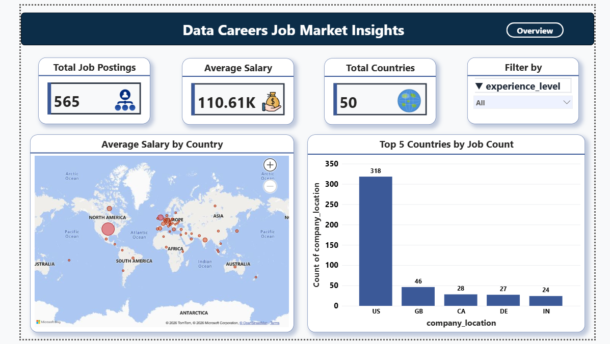
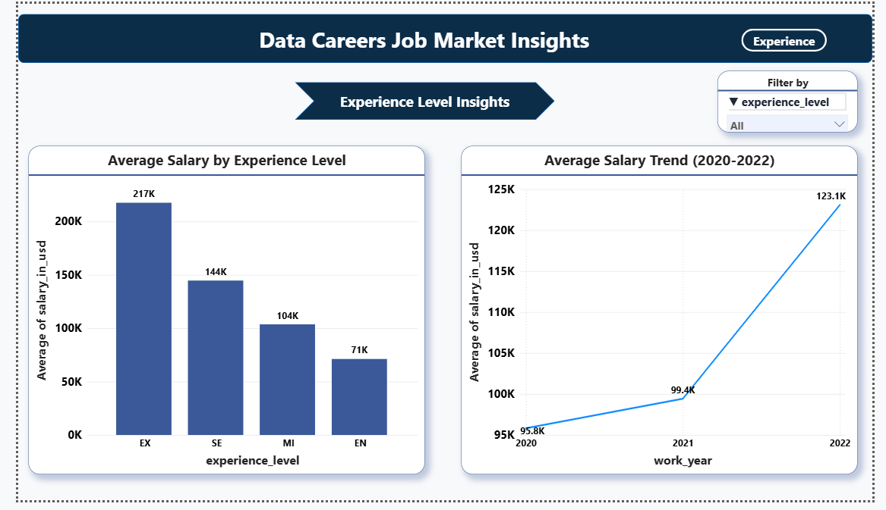
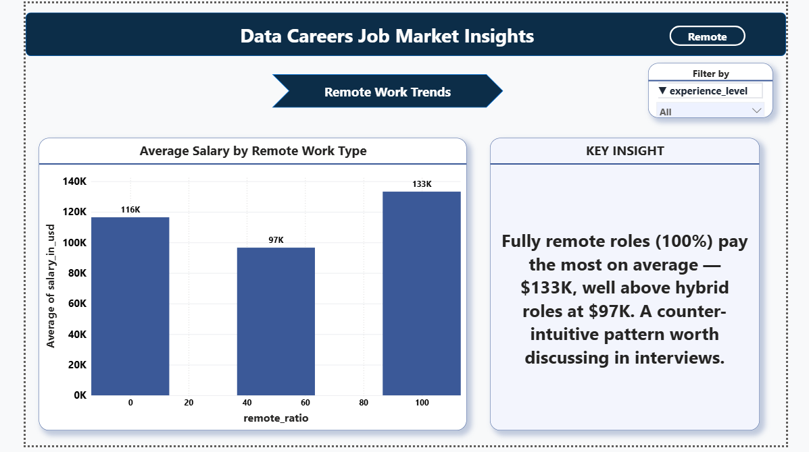
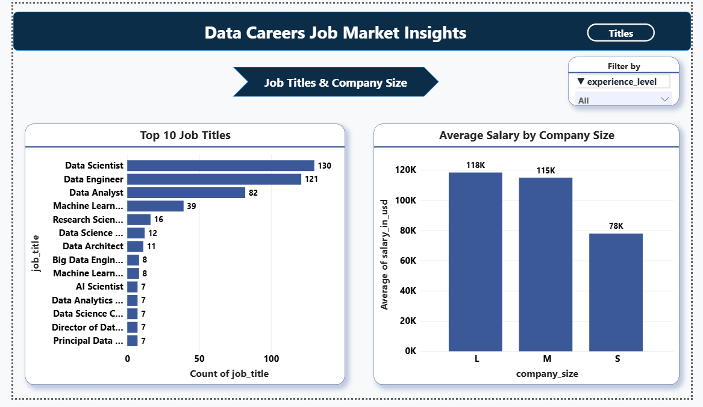

# Data Careers Job Market Analysis (2020-2022)

### End-to-End Data Pipeline: Python → MySQL → Power BI → Excel

**Overview**



**Experience & Salary**



**Remote Work Trends**



**Job Titles & Company Size**



## Project Overview

Analyzed global data science and analytics job postings (565 roles across 50 countries, 2020-2022) to understand what actually drives salary — experience level, company size, remote-work setup, or location — and where entry-level opportunities are concentrated. Built as a personal extension of my own job search, using a complete data pipeline from raw data to an interactive dashboard.

## Tech Stack

| Tool | Purpose |
|------|---------|
| Python (Pandas, Matplotlib, Seaborn) | Data cleaning + exploratory data analysis |
| MySQL | Data storage + business analysis via SQL |
| Power BI | 4-page interactive dashboard |
| Excel | Summary report with a pivot-style table and conditional formatting |

## Data Pipeline

1. **Python** — Loaded the raw CSV, dropped a leftover index column, identified and removed 42 duplicate rows (607 → 565 rows), verified no missing values, and confirmed correct data types (`job_market_eda.ipynb`). A second notebook (`job_market_visualization.ipynb`) generated 4 exploratory charts (salary by experience level, salary trend by year, salary by remote-work type, top 10 job titles) plus a correlation heatmap.

2. **Python → MySQL** — The cleaned dataset was loaded into a local MySQL database (`job_market`, table `salaries`) via SQLAlchemy for SQL analysis. The database password is entered at runtime (`getpass`) rather than hardcoded, so it's never stored in the notebook file.

3. **MySQL** — Wrote 10 business queries using `GROUP BY`, `HAVING`, and window functions (`RANK`, `LAG`, `ROW_NUMBER`) to answer the business questions below.

4. **MySQL → Power BI** — Power BI connected directly to the MySQL database (Import mode), so the dashboard pulls from the same cleaned table used for the SQL analysis. Built a 4-page dashboard with a consistent navy/blue color theme.

5. **Excel** — Summarized findings in a pivot-style summary table (Experience Level × Company Size, built with `AVERAGEIFS` formulas) with conditional formatting, plus a dedicated Key Insights sheet.

## Key Business Questions Answered

1. What is the average salary for each experience level?
2. Which are the top 5 highest paying jobs?
3. Which countries have the most job postings?
4. What are the top 3 highest paying jobs within each experience level?
5. How did average salary change year by year (2020-2022)?
6. Does company size (Small/Medium/Large) affect average salary?
7. Which countries have the most entry-level (fresher) jobs?
8. What is the highest paying job in each country?
9. Do remote jobs pay more than office or hybrid jobs?
10. What is the most common employment type?

## Key Findings

- **Experience level is the strongest driver of salary** — Executive-level roles average **$199,392** versus **$61,643** for Entry-level, a difference of over 3x.
- **Average salary rose sharply from 2020 to 2022** — from **$95,813** to **$99,854** to **$124,522** — reflecting the post-pandemic surge in demand for data roles.
- **Fully remote roles pay more on average than hybrid roles** — a counter-intuitive pattern worth discussing in interviews, since "hybrid" is often assumed to be the more competitive option.
- **Large and Medium-sized companies pay noticeably more on average than Small companies** across almost every experience level.
- **The United States dominates job postings** (318 of 565, ~56%), followed by the UK (46), Canada (28), Germany (27), and India (24).
- **Data Scientist, Data Engineer, and Data Analyst** are the three most common job titles in the dataset.

## Dashboard Pages

| Page | Focus |
|------|-------|
| Overview | Total postings, average salary, countries represented, salary-by-country map, top 5 countries by job count |
| Experience & Salary | Average salary by experience level, salary trend across 2020-2022 |
| Remote Work Trends | Average salary by remote-work type (office / hybrid / fully remote), with a key-insight callout |
| Job Titles & Company Size | Top 10 job titles by count, average salary by company size |

All four pages share an `experience_level` slicer for interactive filtering.

## Dataset

Source: [Kaggle - Data Science Job Salaries](https://www.kaggle.com/datasets) (`ds_salaries.csv`)

Columns: `work_year`, `experience_level`, `employment_type`, `job_title`, `salary`, `salary_currency`, `salary_in_usd`, `employee_residence`, `remote_ratio`, `company_location`, `company_size`

**Note:** This dataset covers 2020-2022 job postings, not current-year data. All figures in this project should be read as historical trends, not a live snapshot of today's market.

## Data Limitations

- The dataset covers **2020-2022 only** — global salary trends may have shifted since then, and this is called out explicitly rather than implied to be current.
- At 565 rows, some experience-level × company-size combinations (e.g., Entry-level at Small companies) are based on a modest sample size, so individual cell averages in the Excel summary should be read as directional rather than precise.
- The dataset is **heavily skewed toward the United States** (~56% of postings), so global averages are effectively weighted toward US salary levels.
- `salary_in_usd` (the currency-converted figure) was used for all comparisons instead of the raw `salary` column, since the raw column mixes multiple currencies and is not directly comparable across rows.

## How to Reproduce

1. Download `ds_salaries.csv` from the Kaggle link above and place it in `data/raw/`
2. Run `python/job_market_eda.ipynb` to clean the data (removes 42 duplicate rows and the leftover index column) — this saves `salaries_clean.csv` into `data/cleaned/`
3. Run `python/job_market_visualization.ipynb` to generate the exploratory charts (salary by experience level, salary trend by year, salary by remote-work type, top 10 job titles) and the correlation heatmap
4. Set up a local MySQL database named `job_market` with a `salaries` table, and load the cleaned CSV into it (the last cell of `job_market_eda.ipynb` does this via SQLAlchemy — it will prompt for your MySQL password rather than storing it in the notebook)
5. Run the queries in `sql/job_market_queries.sql` in MySQL Workbench
6. Open `powerbi/job_market_dashboard.pbix` in Power BI Desktop and update the MySQL connection credentials under Transform Data → Data Source Settings
7. Open `excel/Job_Market_Summary_Report.xlsx` — the Summary sheet formulas recalculate automatically if the Data sheet is refreshed with new data

## Project Structure

```
Job-Market-Analysis/
├── data/
│   ├── raw/
│   │   └── ds_salaries.csv
│   └── cleaned/
│       └── salaries_clean.csv
├── python/
│   ├── job_market_eda.ipynb
│   └── job_market_visualization.ipynb
├── sql/
│   └── job_market_queries.sql
├── powerbi/
│   └── job_market_dashboard.pbix
├── excel/
│   └── Job_Market_Summary_Report.xlsx
├── images/
│   ├── 1_overview.png
│   ├── 2_experience_salary.png
│   ├── 3_remote_work.png
│   └── 4_job_titles.png
└── README.md
```

## About Me

Fresher Data Analyst with hands-on skills in Power BI, SQL, Excel, and Python. This project reflects an end-to-end pipeline built independently — from raw data to an interactive, business-focused dashboard — as a second portfolio project alongside [IPL Cricket Analytics](https://github.com/vanshdevkant/IPL-Cricket-Analytics).

Connect with me on [LinkedIn](https://www.linkedin.com/in/vansh-devkant-397ba62a1)
